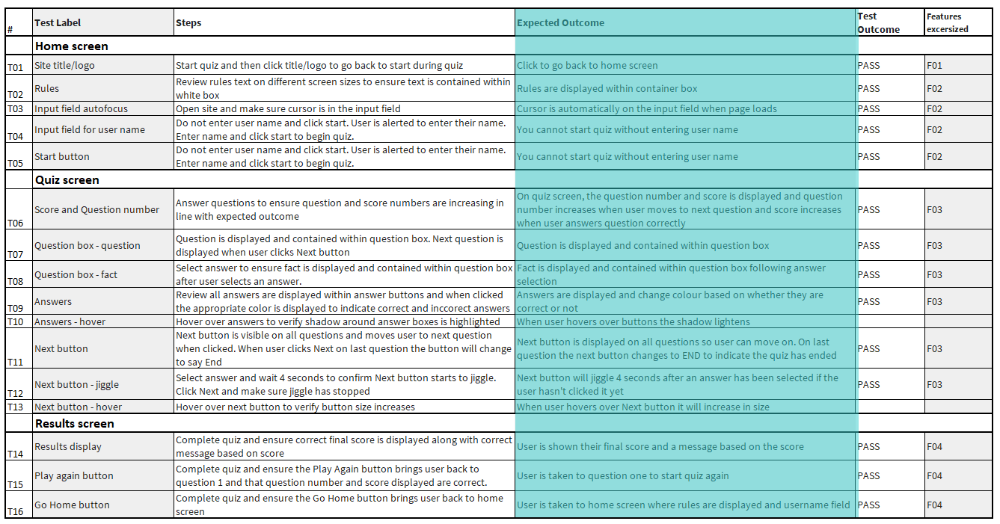

# The Big Fat Quiz Of The Year - 2023 Edition

[View the live project here](https://designasaweapon.github.io/PP2-Big-Fat-Quiz-v3/)

Welcome to the online trivia quiz dedicated to promoting the 2023 edition of Channel 4 Television's "The Big Fat Quiz of The Year." Test your general knowledge of global events from 2023 on this interactive platform. Simply enter your name to begin the quiz, featuring 10 questions that dynamically update as you play. Upon completion, view your results and choose between replaying or returning home. Let's get started

## Index – Table of Contents
* [User Experience (UX)](#user-experience-ux) 
* [Features](#features)
* [Design](#design)
* [Technologies Used](#technologies-used)
* [Testing](#testing)
* [Deployment](#deployment)
* [Credits](#credits)

## User Experience (UX)

-   ### User stories

    -   #### First Time Visitor Goals
        1. As a First Time Visitor, I want the main purpose of the site to be easily understandable.
        2. As a First Time Visitor, I want to easily access instructions on how to play.
        3. As a First Time Visitor, I want to easily interact with the site to log in and play the quiz.
        4. As a First Time Visitor, I want to easily track the number of questions throughout the quiz.
        5. As a First Time Visitor, I want to easily view my score ongoing and my final quiz results.
        6. As a First Time Visitor, I want to have the option to play again or return to the home screen.
        
    -   #### Repeat Visitor Goals

        1. As a Repeat Visitor, I want swift and effortless access to the quiz.
     
    -   #### Regular Visitor Goals
    
        1. As a Regular Visitor, I want to discover fresh questions and categories every time I play.
           
## Features

#### Existing Features

- __TITLE__

    - The capitalized title is highlighted with a shadow effect to enhance its visibility against the background.
    - Font Awesome icons are incorporated to accentuate the title.
    - Users have the convenience of clicking on the title to return to the home screen at any juncture during gameplay.

- __HOME__

    - Upon landing on the home screen, players encounter the prominently displayed title alongside sections for presenting the rules and instructions on how to play.
    - An input field is provided for users to enter their names, accompanied by a start button to initiate the quiz.
    - The design is characterized by simplicity, featuring a background that resonates with the branding of the Channel 4 program, aligning with the annual quiz broadcast in December 2023.
    - To provide visual depth and emphasis, all elements incorporate drop shadows, enhancing the clarity and prominence of text, navigation, and featured components on the page.
    
    

    - The input field is configured to automatically load the cursor, facilitating seamless entry of the user's name with minimal effort.
    - If users attempt to initiate the quiz without entering their name first, they will receive a prompt reminding them to input their name into the designated field.
      

![image]

- __QUIZ__
    
    - Clicking the start button on the home screen, users will transition to the game screen.
    - The quiz screen comprises four key elements: the question number and current score, the question itself, the four possible answers, and a button to proceed to the next question.
    - The aesthetics of the elements are styled in accordance with the design of the home screen, ensuring consistency and coherence throughout the user experience (UX).
       
    

    - On clicking an answer, the buttons will dynamically change color. The correct answer button will turn green while the incorrect ones will be highlighted in red.
    - A relevant fact or link to further info will replace the question, aiding the user's learning process.
    - This visual cue allows users to readily identify the correct answer and enhances their comprehension as they progress through the quiz.
    - Furthermore, the score will increment if the user selects the correct answer, reinforcing their success in the game.

    

    - Once the user selects an answer, it becomes disabled, initiating progression to the next question.
    - After four seconds, the NEXT button will begin to jiggle, signaling to the user to proceed to the subsequent question.
    - Upon reaching the final question, the NEXT button transitions to "END," and the results screen is automatically presented, facilitating a seamless conclusion to the quiz experience.
    
- __RESULTS__
    
    - The results screen features a section showcasing the final score and a personalized message to the user, incorporating the name they provided on the home screen.
    - The message content is contingent upon the final score achieved. Additionally, two interactive buttons are available:
    - "Play Again," which resets the quiz to question 1, and
    - "Home," which redirects the user to the home screen for navigation convenience.
    
    
    
- __404 PAGE__
    
    - The 404 error page adheres to the overall design scheme of the quiz and offers two options for redirecting the user to the home screen:
    - Clicking on the title logo or...
    - Selecting the text within the box container.
 
    

#### Future Features

  - Adding further categories and questions during future development will ensure that returning users continue to derive value from the platform and discover new content to sustain their interest.
    

## Design

-   ### Title/Logo

    -   The title logo employs the Abril Fat Face font sourced from Google Fonts.
    -   The font has been selected to infuse a playful ambiance into the game while mirroring the style of the official quiz logo.
    -   Additionally, world icons flanking the title are sourced from "Font Awesome" to complement the design.

-   ### Imagery

    -   The background image selected is still taken from the 2023 Channel 4 production of The Big Fate Quiz of the Year.

-   ### Typography

    -   Google Fonts were used to import the relevant fonts into styles.css.
    -   This was chosen to mirror the quiz logo and give a fun feel throughout.
 
-   ### Color

    -   A simple and clear monochromatic pallete was chosen for the text
    -   With correct answers highlighted in the 2023 Pantone color of the year, Teal.
    -   Incorrect answers are highlighted in the Fuchsia tone taken from the program branding.

-   ### Wireframes

#### Home Screen Wireframes

#### Quiz Screen Wireframes

#### Results Screen Wireframes

## Technologies Used

### Languages Used

-   [HTML5](https://en.wikipedia.org/wiki/HTML5)
-   [CSS3](https://en.wikipedia.org/wiki/Cascading_Style_Sheets)
-   [JavaScript](https://en.wikipedia.org/wiki/JavaScript)

### Frameworks, Libraries & Programs Used

-   [Google Fonts:](https://fonts.google.com/) was used to import the fonts into the style.css file.
-   [Font Awesome:](https://fontawesome.com/) was used to add icons for the title and social media websites.
-   [GitHub:](https://github.com/) is used as the respository for the projects code after being pushed from Git.
-   [TinyPNG](https://tinypng.com/) was used for compressing images.
-   [Convertio](https://convertio.co/) was used to convert image files from jpg to avif.
-   [Balsamiq:](https://balsamiq.com/) was used to create the wireframes.
-   [Cloud Convert:](https://cloudconvert.com/) was used to convert image files from jpg to webp.
-   [Favicon:](https://favicon.io/favicon-converter/) was used to produce a favicon in the font and colorway.
-   Chrome dev tools were used to troubleshoot, test and check responsiveness of features.
    
## Testing

### Manual Test Cases and Results

- The below tables detail the test cases that were used, the results and a cross-reference to the Feature ID that each test case exercises.

- Testing has been carried out on the following browsers :

    - Chrome Version 110.0.5481.178 (Official Build) (64-bit)
    - Firefox Version Version 110.0.1 (64-bit)
    - Edge Version 110.0.1587.57 (Official build) (64-bit)

### Responsivity Testing

- iPad – 768px x 1024px

- iPhone 13 – 375px x 667px
    

 
 ### Automated Validator Testing

- [HTML Validator](https://validator.w3.org/)

    - result for index.html

    

    - result for 404.html

    

 - [CSS Validator](https://jigsaw.w3.org/css-validator/)

    

- [JSHint Validator](https://jshint.com/)

    - script.js
      The undefined questions are defined in the data.js file
      The undefined oldScore and finalScore variables are used to reset and increment the player's score.
      
    
  
    - The data.js Hints
      The unused variable flagged is used in the script.js file.

    

- [PageSpeed Insights](https://pagespeed.web.dev/)

[Link Here](https://pagespeed.web.dev/analysis/https-designasaweapon-github-io-PP2-Big-Fat-Quiz-v3/dp5ht07kcm)

## Deployment

### How this site was deployed

- Login to Github
- Click on the GitHub repository for this project (https://...)
- Click on the Settings tab, then choose Pages from the left hand menu 
- From the source section drop-down menu, select the Main Branch
- Once the main branch has been selected, click save.
- The page will refresh with a notification that” Your site is live”
- Any changes pushed to the master branch will take effect on the live project

[The live link can be found here](https://designasaweapon.github.io/PP2-Big-Fat-Quiz-v3/) 
  
### How to clone the repository

- Go to the https:... repository on GitHub 
- Click the "Fork" button in the top right corner

### How to clone the repository

- Go to the https://... repository on GitHub 
- Click the "Code" button to the right of the screen, click HTTPs and copy the link there
- Open a GitBash terminal and navigate to the directory where you want to locate the clone
- On the command line, type "git clone" then paste in the copied url and press the Enter key to begin the clone process

## Credits

### Content

- The entirety of the question content was authored and validated by the creator, drawing insights from The Big Fat Quiz of The Year 2023 (Channel 4) and various end-of-year quizzes released by prominent media organizations in December 2023.

### Code research

- Elements of the javascript code were researched EXTENSIVELY using youtube tutorials including Web Dev Simplified [Link](https://www.youtube.com/watch?v=riDzcEQbX6k&t=1124s)

### Acknowledgements

- My heartfelt gratitude to my wife, Ciara, as well as to my family and friends, for generously dedicating their time to support me in grasping JavaScript. Your unwavering encouragement, testing, and constructive feedback on the application have propelled me forward, enabling me to challenge myself and enhance my understanding of both the technology and the project.

- A massive thanks to my mentors and tutors, Your boundless patience during the challenges encountered with WebinarNow and the difficult decision to restart the project multiple times has been invaluable to me. Thank you all sincerely for your steadfast support and understanding.
